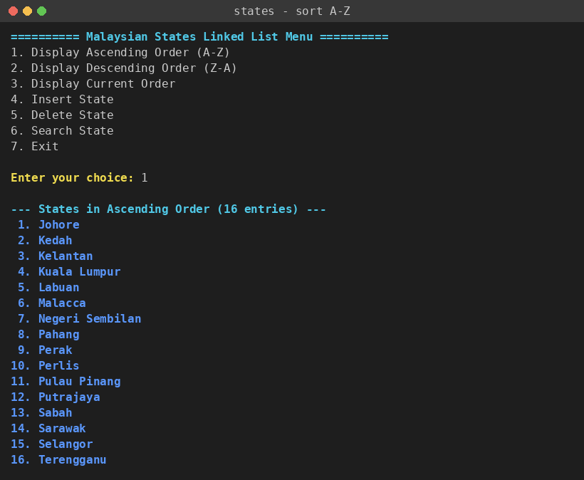
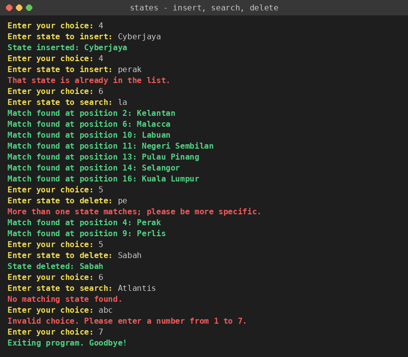
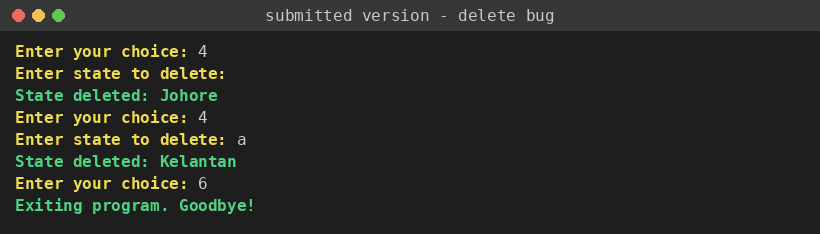
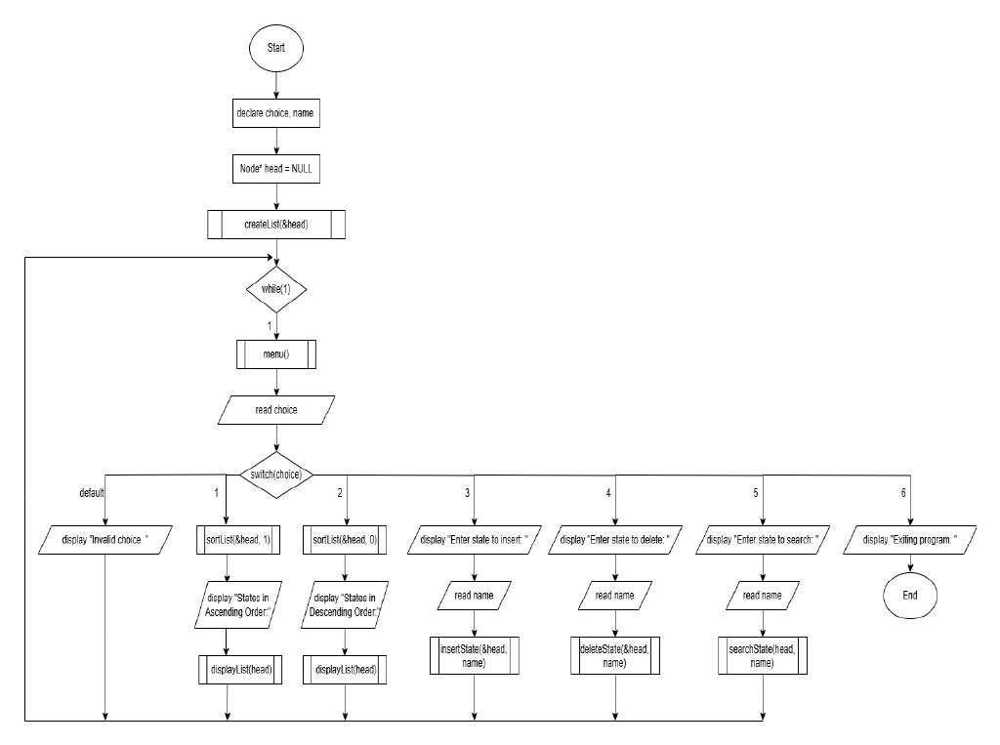

# Malaysian States Linked List (C)

A menu-driven command-line program in C that stores Malaysia's 13 states and 3 federal territories in a **singly linked list** and supports sorting, insertion, deletion and case-insensitive partial search.

Originally a group assignment for **BIC10404 Data Structures (Struktur Data)**, Universiti Tun Hussein Onn Malaysia (UTHM), Semester 2, Session 2024/2025. This repository is a cleaned-up and extended version; see [What changed after submission](#what-changed-after-submission).



## Features

- Builds the initial list of 16 states and federal territories using dynamic allocation (`malloc`).
- Sorts alphabetically A–Z or Z–A using **merge sort that relinks nodes** (O(n log n), stable, no data copying).
- Inserts new entries at the tail, rejecting empty names, names over 49 characters and duplicates (case-insensitive).
- Searches with case-insensitive partial matching and reports every match with its position.
- Deletes safely: an exact match is deleted; otherwise a partial match is deleted only if it is unique. Ambiguous input lists the candidates instead of deleting the wrong node.
- Validates menu input (non-numeric input no longer causes an infinite loop) and exits cleanly on end-of-file.
- Frees every node on exit; verified leak-free with AddressSanitizer/LeakSanitizer.
- List logic is separated from the user interface and covered by 83 unit-test checks. A mutation check introduces 7 deliberate bugs and confirms the tests catch every one; GitHub Actions runs all of this on each push.

## Tech stack

C11 (standard library only), GCC or Clang, GNU Make, AddressSanitizer + UndefinedBehaviorSanitizer, GitHub Actions.

## How to run

**Linux / macOS / WSL**

```bash
make            # builds build/states
make run        # starts the interactive menu
make test       # runs the unit tests
make sanitize   # tests + scripted demo under ASan/UBSan (leak check included)
make mutation   # confirms the tests catch deliberately introduced bugs
make original   # builds the code exactly as submitted, for comparison
```

**Windows (MinGW-w64 / MSYS2)**

```bash
gcc -std=c11 -Wall -Wextra src/main.c src/states_list.c -o states.exe
states.exe
```

If your terminal shows codes like `[1;36m` instead of colours, run `states --no-color` or set the `NO_COLOR` environment variable.

## Usage

```
========== Malaysian States Linked List Menu ==========
1. Display Ascending Order (A-Z)
2. Display Descending Order (Z-A)
3. Display Current Order
4. Insert State
5. Delete State
6. Search State
7. Exit
```

Sorting changes the list itself, so positions reported by search reflect the most recent sort.

## Results

Screenshots are captured from real pseudo-terminal runs, so typed input appears exactly as the terminal echoed it (`scripts/capture_screenshots.py` regenerates them). The full scripted session is in [`docs/sample_run.txt`](docs/sample_run.txt) (input: [`tests/demo_input.txt`](tests/demo_input.txt)).



Highlights from the run:

| Action | Input | Output |
|---|---|---|
| Insert a new entry, then sort A–Z | `Cyberjaya` | Placed at position 1 of 17, alphabetically before Johore |
| Insert a duplicate | `perak` | `That state is already in the list.` |
| Search (partial) | `la` | 7 matches, including Kelantan, Pulau Pinang and Kuala Lumpur |
| Delete (ambiguous) | `pe` | Nothing deleted; lists Perak and Perlis |
| Delete (exact) | `Sabah` | `State deleted: Sabah` |
| Delete (empty line) | *(blank)* | `Name cannot be empty.` |
| Search (missing) | `Atlantis` | `No matching state found.` |
| Menu (bad input) | `abc` | `Invalid choice. Please enter a number from 1 to 7.` |

Unit tests:

```
$ make test
83 checks, 0 failed

$ make mutation
killed   flip sort comparison
killed   delete first partial match
killed   empty query matches all
killed   skip duplicate check
killed   case-sensitive compare
killed   off-by-one length limit
killed   0-based search positions
0 mutant(s) survived
```

The first mutation run left two mutants alive (the 49/50-character boundary and 1-based positions), which led to two extra tests.

## Complexity

| Operation | Time | Notes |
|---|---|---|
| Insert at tail | O(n) | walks to the tail; also checks for duplicates |
| Search | O(n·m) | m = query length (naive substring match) |
| Delete | O(n) | single pointer-to-pointer pass handles head, middle and tail |
| Sort | O(n log n) | merge sort on the list itself |
| Free all | O(n) | |

## Findings

Moving from bubble sort with data swapping to merge sort with relinking removed all `strcpy` work during sorting and made the sort order correct for entries that were not in the original list. Separating list logic from printing was the change that made the code testable: every operation now returns a status code, and the CLI decides how to show it. The submitted version's delete bug, reproduced from a real run of the original code (the first delete prompt was answered by pressing Enter):



## Limitations

- Insertion is O(n) because no tail pointer is kept; fine for 16–20 entries, not for large data.
- The list lives in memory only; there is no file save/load.
- Names are limited to 49 characters and compared byte-wise, so non-ASCII names are not case-folded.
- Only the state name is stored (no population, capital or area).

## Project structure

```
malaysian-states-linked-list/
├── .github/workflows/ci.yml   # build + tests + sanitizers on every push
├── docs/
│   ├── flowcharts/            # flowcharts from the original report (submitted design)
│   ├── screenshots/           # captured from real terminal runs
│   └── sample_run.txt         # full scripted session output
├── original/
│   └── submitted_version.c    # code as submitted, kept for comparison
├── scripts/
│   ├── capture_screenshots.py # regenerates screenshots from real PTY runs
│   └── mutation_check.sh      # deliberate-bug check for the tests
├── src/
│   ├── main.c                 # menu, input handling, output
│   ├── states_list.c          # linked list implementation
│   └── states_list.h          # public API
├── tests/
│   ├── demo_input.txt         # scripted input for the sample run
│   └── test_states_list.c     # unit tests
├── .gitattributes
├── .gitignore
├── CHANGELOG.md
├── Makefile
└── README.md
```

## Design (from the original report)

The flowcharts in [`docs/flowcharts/`](docs/flowcharts/) describe the **submitted** version (bubble sort, six-option menu). The main program flow:



## What changed after submission

The submitted program is in [`original/submitted_version.c`](original/submitted_version.c). After the course I (Musaab Fahmi Fadhl Al-Husaini) made these changes:

- Fixed "ascending/descending" sorting, which followed the hard-coded array order rather than A–Z, and pushed newly inserted states to the top.
- Replaced bubble sort with merge sort that relinks nodes.
- Fixed deletion of the wrong node on empty or very short input; added the exact-match-first rule.
- Fixed the infinite loop on non-numeric menu input; added EOF handling and input-length checks.
- Added duplicate and empty-name validation; removed the 16 "State inserted" messages printed at startup.
- Freed all memory on exit and replaced POSIX-only `strcasecmp` with a portable helper.
- Split the code into a library (`states_list.c/.h`) and CLI (`main.c`), and added unit tests, sanitizer and mutation checks, a Makefile and CI.

Full details are in [CHANGELOG.md](CHANGELOG.md).

## Team

Original group project by:

- Chie Wai Lun
- Lim Zheng Yu
- Nathens Chua Haoyang
- Thang Jing Lang
- Muayad Ahmed Mohsen Al-Samawi
- Musaab Fahmi Fadhl Al-Husaini
